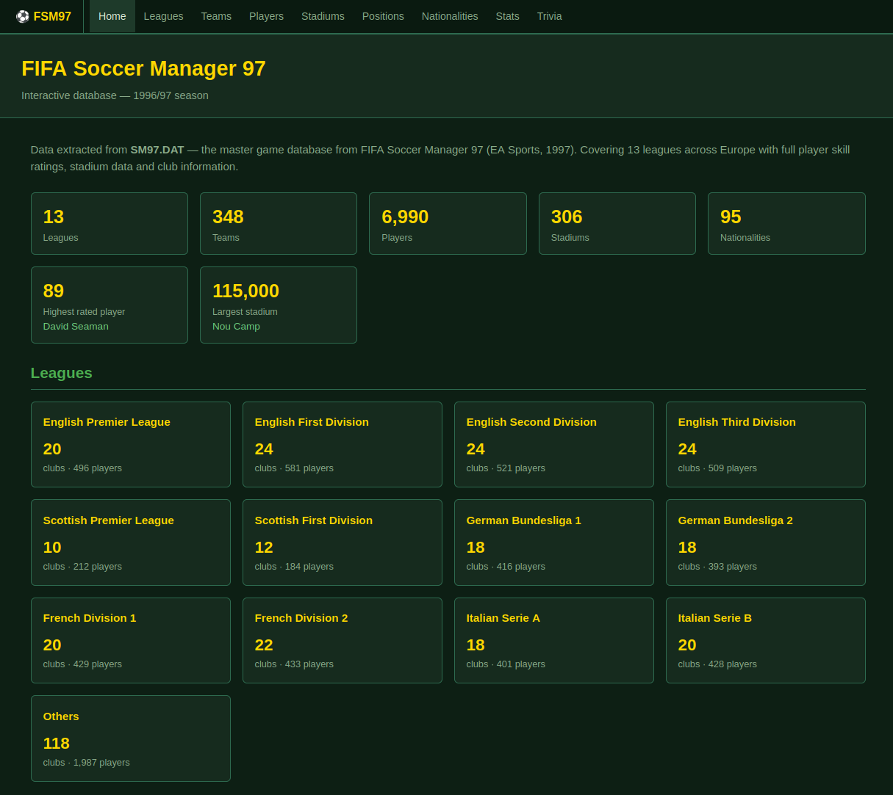

# fsm-97-data

Extracting data from **FIFA Soccer Manager 1997** game data

View the website at https://fsm.bennuttall.com/

## Contents

- Python library for extracting and processing game data, and building the static website
- CSV files of data extracted from the game files
- Extensive HTML static website built from the CSV data
- Apache log processing and analytics site (see [docs/analytics.md](docs/analytics.md))

## Claude

This project was built using [Claude](https://claude.ai/), however if you have the original game
data available, you would be able to reproduce the CSVs and the website by running the generated
Python code.