# Relegation

Cutscene played when relegated (~18 seconds). Transcribed from `fmv/REL.TGQ`. Blue-tinted footage with overlaid text: "Relegation". Centrepiece is a man in the stands, head thrown back in anguish.

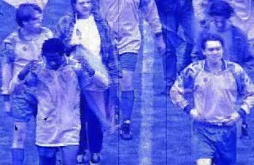

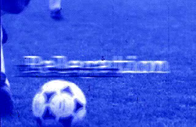

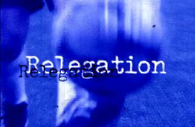

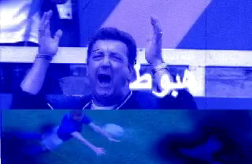

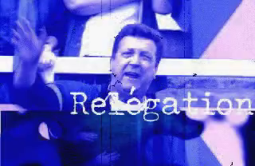

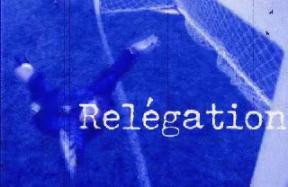

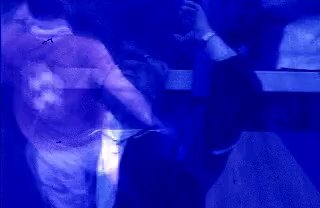

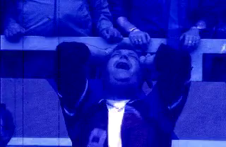

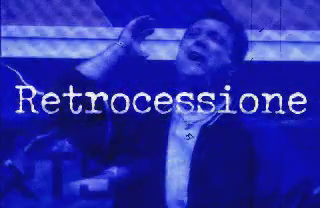

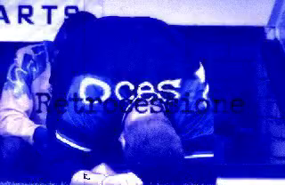

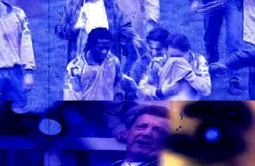

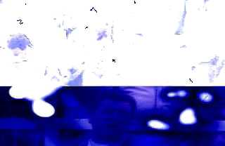

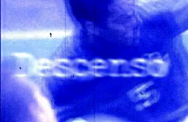

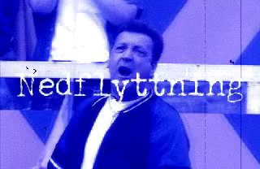

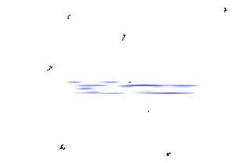

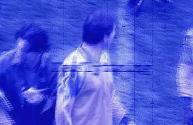

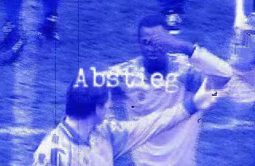
